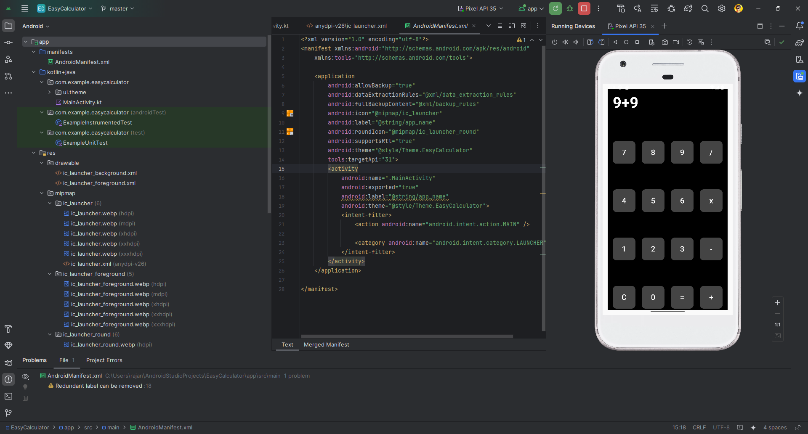
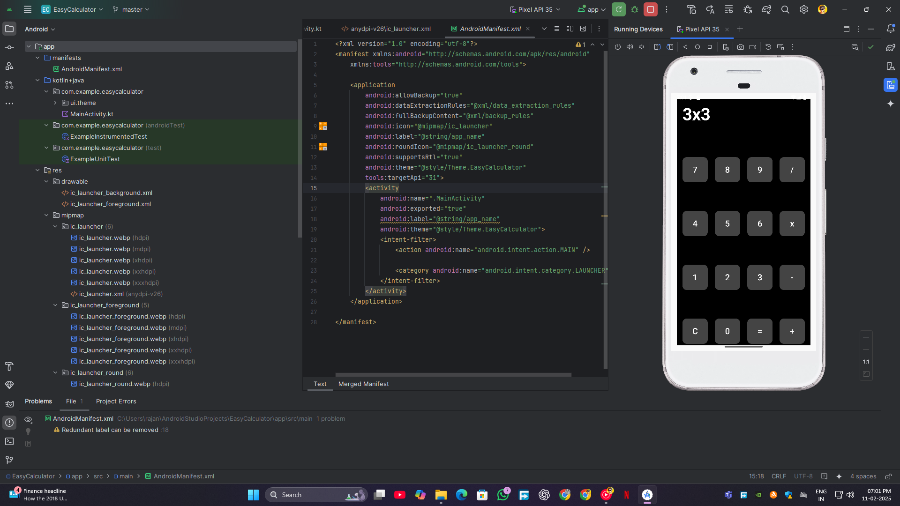

# EasyCalculator

A simple Android app built using **Jetpack Compose** in **Kotlin** that performs basic arithmetic operations. This app is designed as a beginner-friendly calculator with a clean and intuitive user interface.

## Features

- Basic arithmetic operations: addition, subtraction, multiplication, division
- Responsive user interface built with Jetpack Compose
- Lightweight and simple to use

## Installation

To build and run this app, follow these steps:

1. Clone this repository to your local machine:
   ```bash
   git clone https://github.com/AkkashJR/EasyCalculator.git
NOTE: *********************
* The arithmetic operations while typing (eg: 9+9 then tapping on = gives 18 it won't show the question when tapping is equal to sign.
  
## 📸 Screenshots

### ➕ Addition Operation
**Input:**  
  
**Output:**  


### ➖ Subtraction Operation
**Input:**  
  
**Output:**  


### ✖️ Multiplication Operation
**Input:**  
  
**Output:**  


### ➗ Division Operation
**Input:**  
  
**Output:**  

